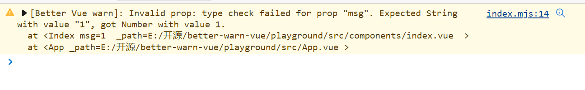

# better-vue-warn

This is a plugin, let vue3 has a better warn.

Add the Component's file path to the warn info.

在Vue3中使用此款插件，优化警告信息。

将组件的文件路径添加到警告信息上去。

## Usage

main.ts
```ts
import { createApp } from 'vue'
import './style.css'
import App from './App.vue'
import betterVueWarn from 'better-vue-warn'

const app = createApp(App)
app.use(betterVueWarn).mount('#app')

```



## TODO
